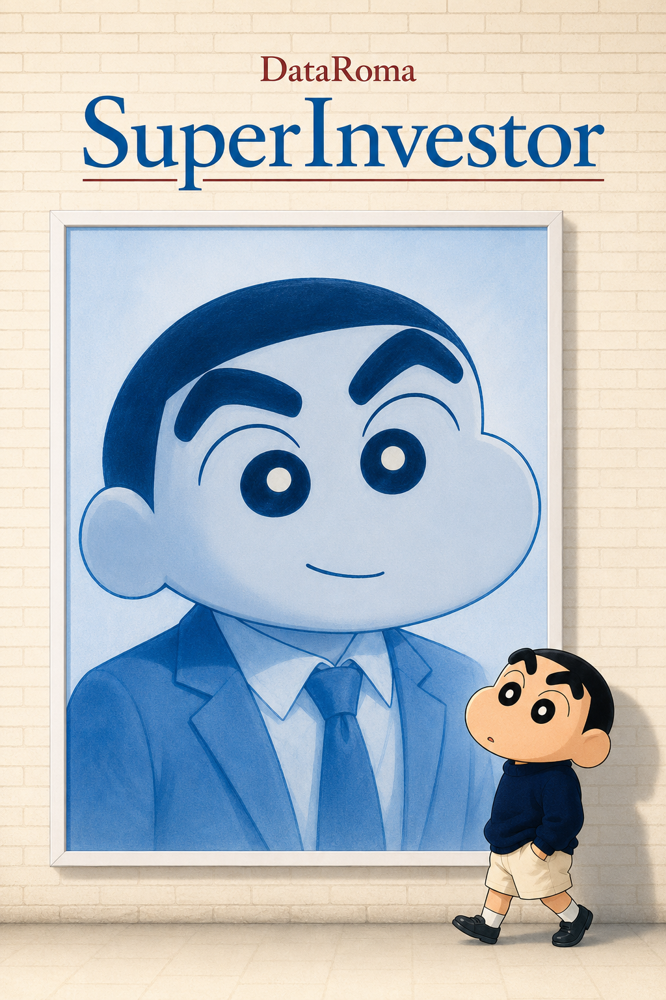

# Images 갤러리

`Images/` 폴더의 모든 이미지 68장입니다. 생성 시점을 알 수 있는 이미지는 앞쪽에 시간순으로, 시점을 알 수 없는 이미지는 뒤쪽에 같은 생성 배치끼리 모아 이어서 배치했습니다.

> 이 파일은 `scripts/generate_gallery.py`로 자동 생성됩니다. GitHub Actions의 **Update Gallery** 워크플로를 수동 실행하면 새로 추가된 이미지가 반영됩니다.

| 미리보기 | 미리보기 | 미리보기 | 미리보기 |
|---|---|---|---|
|  |  |  |  |
|  |  |  |  |
|  |  |  |  |
|  |  |  |  |
|  |  |  |  |
|  |  |  |  |
|  |  |  |  |
|  |  |  |  |
|  |  |  |  |
|  |  |  |  |
|  |  |  |  |
|  |  |  |  |
|  |  |  |  |
|  |  |  |  |
|  |  |  |  |
|  |  |  |  |
|  |  |  |  |
